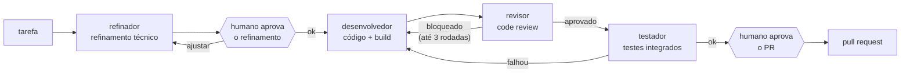
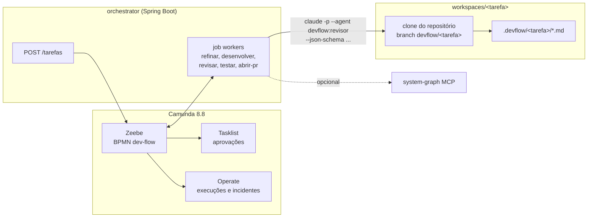
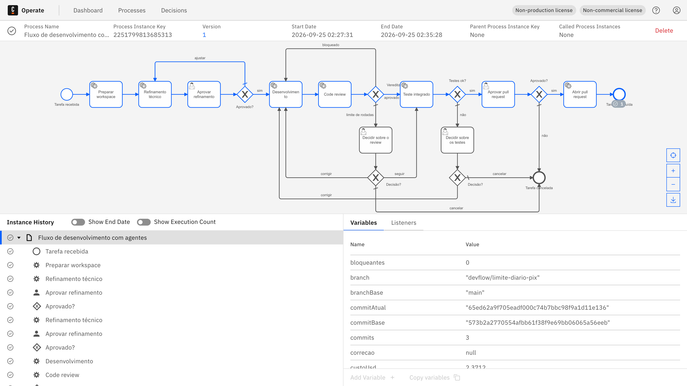
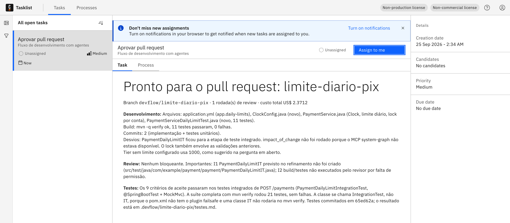

# ai-dev-flow

Um agente de IA por etapa do desenvolvimento, com um humano aprovando nos pontos que importam:



O repositório tem duas formas de rodar o mesmo fluxo:

1. **Plugin do Claude Code** ([`plugin/`](plugin)): skills e subagentes para usar no dia a dia, direto no terminal.
   `/devflow:tarefa` conduz o fluxo inteiro e as skills de cada etapa também funcionam sozinhas, como
   `/devflow:code-review` numa branch qualquer.
2. **Orquestrado pelo Camunda 8** ([`orchestrator/`](orchestrator)): o fluxo vira um BPMN, cada etapa é um job
   worker Java que chama o Claude Code em modo headless, as aprovações são tarefas no Tasklist e cada execução
   fica auditada no Operate.

Os dois usam os mesmos arquivos de agente e de skill. O que muda é quem controla a ordem das etapas: no primeiro,
um orquestrador que também é um agente; no segundo, um motor de processo determinístico.

## Decisões de desenho

- **Uma etapa, um agente, um contexto limpo.** Cada agente começa sem saber o que os outros pensaram. Isso é
  mais importante no revisor: se ele herda o raciocínio de quem escreveu o código, tende a concordar.
- **Passagem entre etapas por arquivo, não por conversa.** Cada etapa escreve um documento com formato fixo em
  `.devflow/<tarefa>/` (`refinamento.md`, `desenvolvimento.md`, `review-<n>.md`, `testes.md`). A etapa seguinte lê
  esse arquivo. Quem aprova também lê, pode editar entre as etapas e o conjunto vai para o corpo do PR.
- **Permissão mínima por etapa.** Refinador e revisor só escrevem em `.devflow/`. O testador só mexe em
  `src/test/`. Só o desenvolvedor edita código de produção. Ninguém faz `git push`.
- **O fluxo é determinístico; a autonomia fica dentro da etapa.** A ordem, as voltas e o limite de rodadas estão
  no BPMN (ou na skill `tarefa`), não num prompt. O agente decide como refinar, codar ou revisar, não para onde o
  fluxo vai.
- **Humano onde o custo de errar é alto.** Depois do refinamento (o escopo está certo?) e antes do PR. Nos outros
  pontos, o humano só entra quando o fluxo trava: review bloqueado três vezes ou testes falhando.

## Estrutura

```
.claude-plugin/marketplace.json   marketplace para instalar o plugin
plugin/
  agents/                         refinador, desenvolvedor, revisor, testador
  skills/
    tarefa/                       orquestração interativa do fluxo completo
    refinamento/                  procedimento + template do refinamento.md
    desenvolvimento/              procedimento + formato do desenvolvimento.md
    code-review/                  procedimento + checklist para sistema financeiro + template
    teste-integrado/              procedimento + formato do testes.md
orchestrator/                     Spring Boot + Camunda 8.8: BPMN, formulários, job workers
docker-compose.yml                Camunda 8.8 (Zeebe, Operate, Tasklist) + Elasticsearch
scripts/devflow.sh                iniciar tarefa, listar e concluir tarefas humanas
mcp/system-graph.json             MCP do system-graph para refinador e revisor
docs/exemplo/                     documentos gerados numa execução real
```

## 1. Plugin no Claude Code

```text
/plugin marketplace add Diegobraun/ai-dev-flow
/plugin install devflow@ai-dev-flow
```

Ou, sem instalar, apontando para a pasta: `claude --plugin-dir /caminho/ai-dev-flow/plugin`.

| Skill | Quando usar |
|---|---|
| `/devflow:tarefa <descrição>` | levar uma tarefa do refinamento ao PR, com um subagente por etapa e duas paradas para aprovação |
| `/devflow:refinamento` | só refinar: arquivos afetados, contratos, critérios de aceite, plano de teste, perguntas |
| `/devflow:desenvolvimento` | implementar um refinamento aprovado ou corrigir o que o review apontou |
| `/devflow:code-review` | revisar uma branch ou diff contra o refinamento e o [checklist](plugin/skills/code-review/checklist.md) |
| `/devflow:teste-integrado` | escrever e rodar um teste integrado por critério de aceite |

As skills também são acionadas sem o `/`: pedir "revisa essa branch" carrega a `code-review` pela descrição.

O checklist de review é voltado para sistema financeiro: dinheiro em `BigDecimal`, `compareTo` em vez de
`equals`, idempotência de consumer Kafka, leitura e escrita concorrente de saldo e limite, timeout e retry em
client HTTP, dado sensível em log e compatibilidade de contrato.

Para usar no time sem plugin, copie `plugin/agents` para `.claude/agents` e `plugin/skills` para `.claude/skills`
do repositório. Os nomes passam a ser `/tarefa`, `/code-review` e assim por diante.

## 2. Orquestrado pelo Camunda





### Subir

Precisa de Docker, Java 21, Maven e o Claude Code logado (`claude` no `PATH`).

```bash
docker compose up -d
cd orchestrator && mvn -q package -DskipTests && cd ..
DEVFLOW_WORKSPACES=$PWD/workspaces DEVFLOW_PLUGIN=$PWD/plugin \
  java -jar orchestrator/target/devflow-orchestrator-0.1.0-SNAPSHOT.jar
```

- Operate: http://localhost:8180/operate (demo / demo)
- Tasklist: http://localhost:8180/tasklist (demo / demo)
- Orquestrador: http://localhost:8070

As portas do Camunda (8180, 26600, 9210) não são as padrão para não conflitar com outro Camunda local.

### Rodar uma tarefa

Pelo Tasklist: aba **Processes**, "Fluxo de desenvolvimento com agentes", **Start process**. O formulário pede
identificador, descrição, repositório, branch base e o limite de rodadas de review.

Pelo terminal:

```bash
scripts/devflow.sh nova https://github.com/Diegobraun/system-graph-payment-service.git \
  "Criar um limite diário de PIX por conta..." main limite-diario-pix
```

O `repositorio` pode ser URL ou caminho local. O worker clona em `workspaces/<tarefa>`, cria a branch
`devflow/<tarefa>` e cada agente roda dentro desse clone. As aprovações aparecem no Tasklist com o documento da
etapa renderizado. Pelo terminal:

```bash
scripts/devflow.sh aguardar <processInstanceKey>
scripts/devflow.sh concluir <userTaskKey> '{"refinamentoAprovado": true}'
```



### Como um worker chama o agente

Cada etapa vira um `claude -p` com:

| Opção | Por quê |
|---|---|
| `--agent devflow:<agente>` `--plugin-dir plugin/` | mesmos agentes e skills do uso interativo |
| `--json-schema schemas/<etapa>.json` | saída estruturada que vira variável do processo (`veredito`, `bloqueantes`, `status`...) |
| `--allowedTools` por etapa | ver [`Etapa.java`](orchestrator/src/main/java/com/example/devflow/agente/Etapa.java). O que não está na lista é negado, porque em `-p` não há quem aprove |
| `--disallowedTools` | `git push`, `gh`, `curl`, `WebFetch`, `WebSearch` para todos |
| `--strict-mcp-config` | sem isso, o headless carrega os MCPs do usuário (e-mail, drive...). Só entra o que está em `--mcp-config` |
| `--setting-sources project` | ignora hooks, plugins e configurações pessoais de quem roda o worker |
| `--max-budget-usd` | teto de custo por etapa |

O prompt, a saída JSON e o stderr de cada chamada ficam em `.devflow/<tarefa>/logs/`.

Os agentes restringem ferramentas com `disallowedTools` e não com uma lista fechada em `tools:`. Com `tools:`, o
agente perde a ferramenta interna que o `--json-schema` usa para devolver a saída estruturada, e o resultado volta
só como texto.

### Falhas, retries e estado

- As tarefas de agente têm `retries="1"`. Uma falha (timeout, orçamento estourado, saída sem o schema) vira
  **incidente** no Operate em vez de tentar de novo sozinha, porque repetir um agente gera outro resultado e
  custa de novo. Depois de olhar o log, é só dar retry no Operate.
- Antes de cada etapa, o worker restaura o clone para o `commitAtual` do processo (`git reset --hard` +
  `git clean`). Um retry começa do mesmo ponto, sem sobra da tentativa anterior.
- As variáveis do processo guardam o estado de controle (rodadas, veredito, commits, custo acumulado) e uma
  cópia dos documentos para o Tasklist mostrar. O conteúdo em si fica no git e em `.devflow/`.
- O push e o `gh pr create` só acontecem com `DEVFLOW_ABRIR_PR=true`. Por padrão, o fluxo termina com o
  `pr.md` pronto no workspace.

### Configuração

| Variável | Padrão | |
|---|---|---|
| `DEVFLOW_WORKSPACES` | `./workspaces` | onde os repositórios são clonados |
| `DEVFLOW_PLUGIN` | `../plugin` | pasta do plugin |
| `DEVFLOW_MCP_CONFIG` | vazio | ex.: `mcp/system-graph.json` |
| `DEVFLOW_MODELO_<AGENTE>` | modelo padrão da conta | ex.: `DEVFLOW_MODELO_TESTADOR=sonnet` |
| `DEVFLOW_ABRIR_PR` | `false` | faz push e abre o PR no fim |
| `devflow.limite-de-revisoes` | `3` | rodadas de review antes de chamar um humano |
| `devflow.orcamento-por-etapa-usd` | `5` | teto por chamada de agente |
| `devflow.timeout` | `45m` | tempo máximo de uma etapa |

### Com o system-graph

Com o [system-graph](https://github.com/Diegobraun/system-graph-poc) de pé, `DEVFLOW_MCP_CONFIG=mcp/system-graph.json`
dá ao refinador e ao revisor as tools `impact_of_change`, `service_overview` e `find_contract_issues`. O
refinamento passa a listar quem consome cada contrato alterado, com arquivo e linha, e o revisor bloqueia se o
diff afeta um consumidor que o refinamento não previu. Sem ele, os dois escrevem "consumidores externos não
verificados".

## Exemplo real

[`docs/exemplo/limite-diario-pix`](docs/exemplo/limite-diario-pix) tem os documentos de uma execução completa
pelo Camunda sobre o [payment-service](https://github.com/Diegobraun/system-graph-payment-service).

| Etapa | Custo | Tempo | Resultado |
|---|---|---|---|
| Refinamento, rodada 1 | US$ 0,40 | 63 s | `com-perguntas`: 2 bloqueantes (valor do limite, por faixa ou por conta), 4 menores com sugestão, 7 critérios de aceite, risco de concorrência |
| Aprovação humana | | | devolvido com as respostas: limite por faixa de risco, fuso `America/Sao_Paulo`, lock por conta |
| Refinamento, rodada 2 | US$ 0,29 | 51 s | `pronto`, 9 critérios de aceite, plano de teste por critério |
| Desenvolvimento | US$ 0,65 | 107 s | `Clock` injetável, `app.daily-limits`, lock por conta, 11 testes unitários, 2 commits |
| Code review | US$ 0,42 | 44 s | `aprovado`, 0 bloqueantes, 2 importantes (teste de integração ainda não escrito, build não verificado pelo revisor) |
| Teste integrado | US$ 0,61 | 93 s | 10 testes `@SpringBootTest` + MockMvc, um por critério, incluindo dois pagamentos simultâneos; 21 testes na suíte, 0 falhas |
| **Total** | **US$ 2,37** | **~6 min de agente** | 3 commits, [`diff.patch`](docs/exemplo/limite-diario-pix/diff.patch), [`pr.md`](docs/exemplo/limite-diario-pix/pr.md) |

O segundo ponto "importante" do review levou a uma mudança no fluxo: o revisor passou a poder rodar o build, e
build quebrado virou bloqueante no procedimento dele.

## Testes

```bash
mvn -f orchestrator/pom.xml verify
```

- `DevFlowProcessTest` sobe o Camunda com Testcontainers (Camunda Process Test) e roda o BPMN inteiro com o
  agente simulado: caminho feliz, refinamento devolvido com observações, review bloqueado até o limite, review
  corrigido na segunda rodada, testes falhando e falha do agente virando incidente.
- `ClaudeCodeTest` confere as permissões montadas por etapa e roda um `claude` falso para testar a leitura da
  saída e os erros.

## Limites

- Um workspace por tarefa, na máquina do worker. Para rodar em vários workers, o clone precisa ir para um
  volume compartilhado ou ser refeito a partir da branch a cada etapa.
- O worker bloqueia uma thread por etapa (`maxJobsActive` baixo). Para muitas tarefas em paralelo, o caminho é
  mais instâncias do worker, não mais threads.
- O agente roda com o login do Claude Code de quem sobe o worker. Num ambiente de empresa, o natural é uma chave
  de API própria do serviço e o worker rodando isolado (container sem acesso à rede interna além do git).
